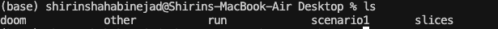
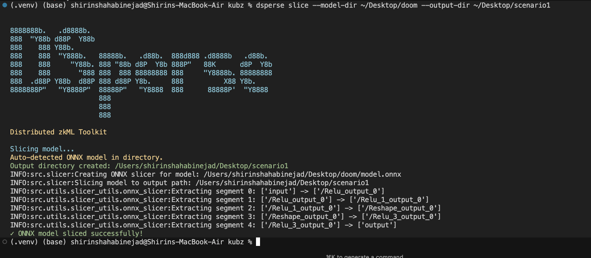
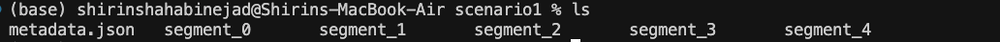
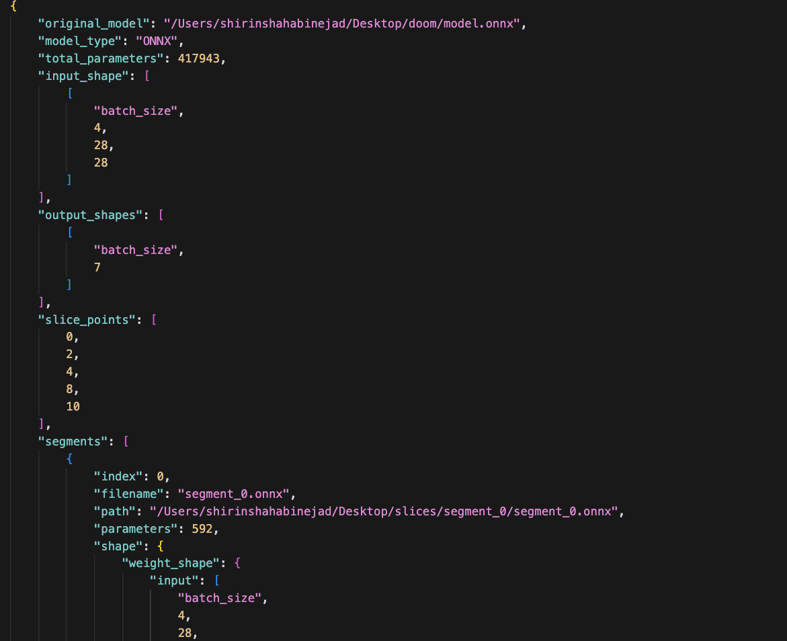
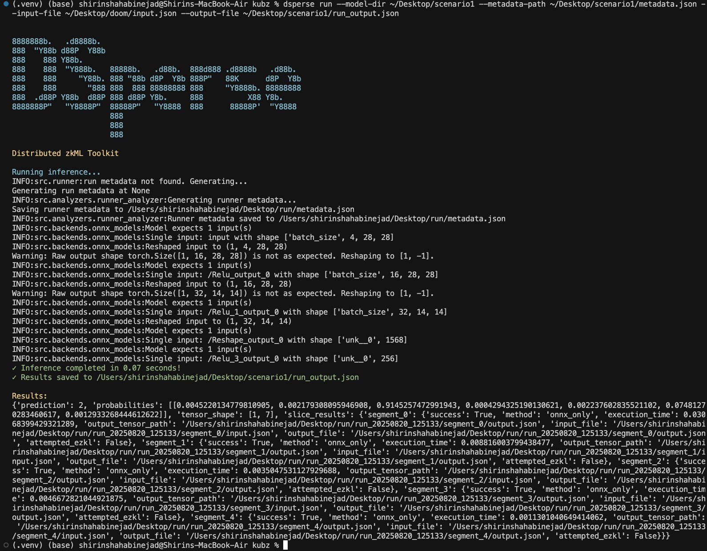
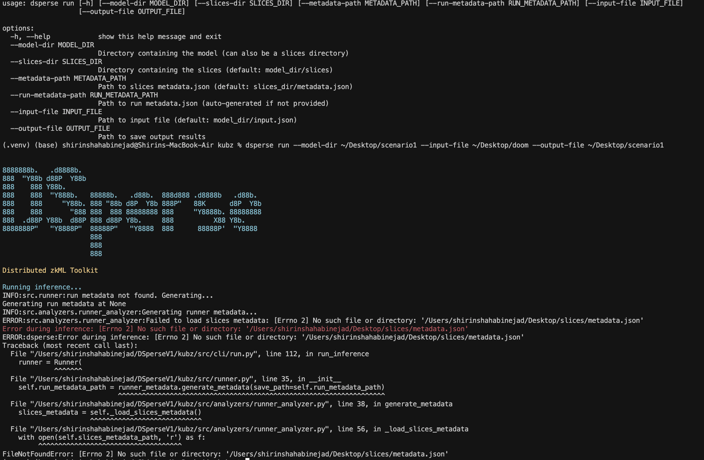
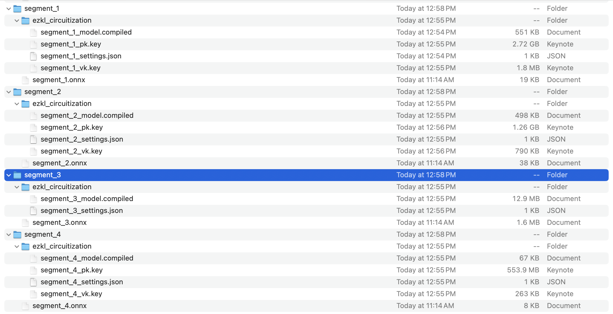
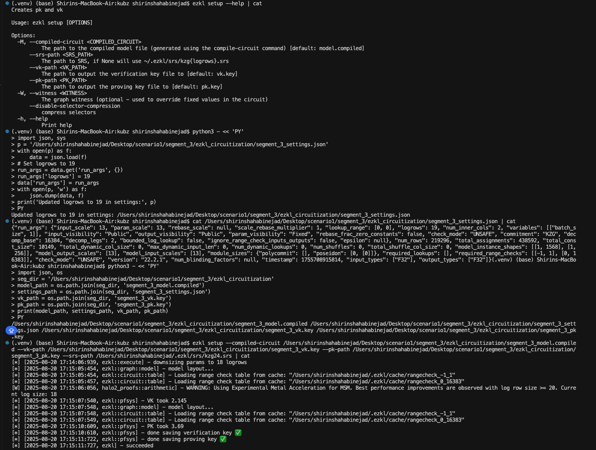
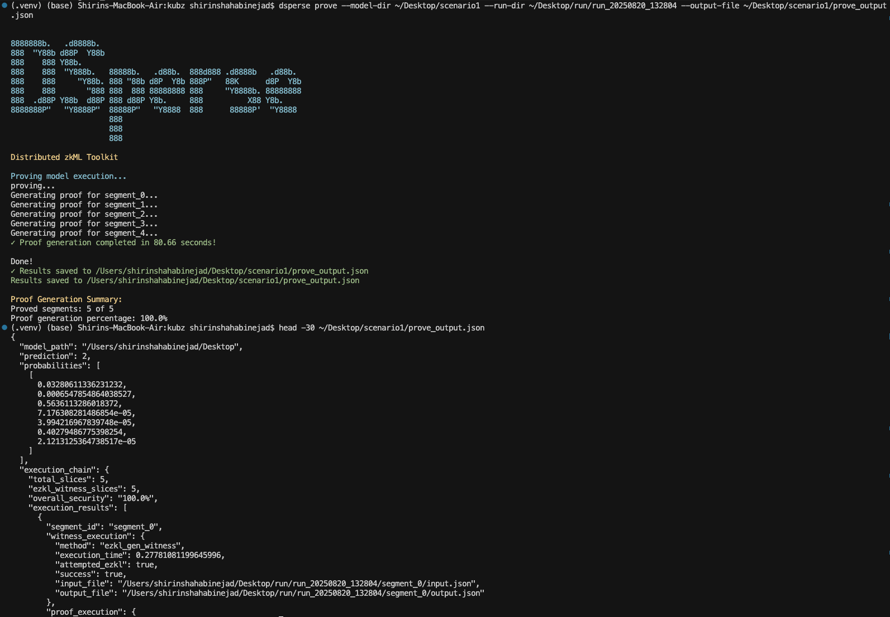
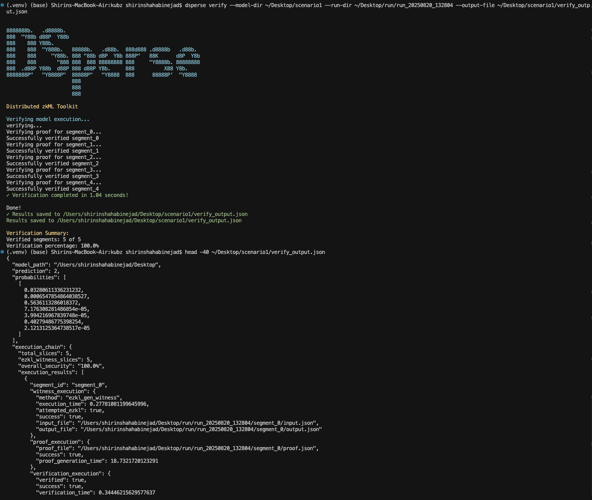

# Bugbash Testing Document

## Version Information
**Project:** Dsperse v1.0.0  
**Branch:** dan/release  
**Commit:** e5d5a1847aaa377ab1eec5d7aeec9682abf64371  
**Date:** 2025-08-19 10:23:21 -0700  
**Author:** dan  
**Last Update:** Rename project from "Kubz" to "Dsperse" across all files, including CLI, documentation, installer, and internal references.

## Setup
 
 - `install.sh`    file will install through 'pip' , add 'uv' 
 - Set a working directory outside of the current working dir
 - `kzg25.srs` and `kzg26.srs` will not supported , will be required for larger slices. 
 - Missing packages : `onnxruntime_extensions`,`transformers`, `onnx_graphsurgeon`
 - `kubz --help` still existed instead of `dsperse --help`
 - a guide for Directory setup: ./doom, ./scenario1, ./run, ./slices(?)

## 📁 Bugbash Folder Contents

### Directory Structure
The Bugbash folder contains comprehensive testing results and artifacts:

- **`scenario1/`** - Complete testing results for Doom model
  - All PNG screenshots from CLI testing
  - JSON output files from each command
  - Segment directories with EZKL circuitization results
  
- **`doom/`** - Original Doom model files
  - `model.onnx` - ONNX model file
  - `input.json` - Test input data
  - `model/` - EZKL circuitization outputs
  
- **`run/`** - Execution run directories
  - `run_20250820_132804/` - Latest successful run with EZKL circuits
  - Contains segment execution results and metadata
  
- **`Setup/`** - Additional setup and configuration files

### JSON Output Files
Key JSON files documenting the testing results:

- **`scenario1/metadata.json`** - Sliced model metadata with EZKL circuitization paths
- **`scenario1/run_output.json`** - Results from successful run command execution
- **`scenario1/prove_output.json`** - Proof generation results (5/5 segments proved)
- **`scenario1/verify_output.json`** - Verification results (5/5 segments verified)
- **`scenario1/proof_output.json`** - Additional proof output data

### Code Diffs
- **`runner_analyzer_diff.patch`** - Fixes for RunnerAnalyzer metadata path handling
- **`runner_diff.patch`** - Updates to Runner class initialization

*Directory structure showing the relationship between doom, scenario1, and run directories*

## Test Scenarios

### Scenario 1: doom_Desktop
**Screenshots folder:** `screenshots/scenario1_doom_desktop/`

#### Section 1: Slice 

`  --model-dir MODEL_DIR`  ✅
`  --output-dir OUTPUT_DIR` ✅
`  --input-file INPUT_FILE` ✅
    - Auto detect Input: ✅

*Successful slicing of the doom model into 5 segments*

*Contents of the slice directory after successful slicing*

*Metadata confirmation that all slices were created correctly*

#### Section 2: Run 

`  --model-dir MODEL_DIR`  ✅
`  --output-file OUTPUT_FILE` ✅
`  --input-file INPUT_FILE` ✅

1. metadata_autocomplete won't go through! the input address should set based on : `--model-dir ~/Desktop/scenario1`

2.The RunnerAnalyzer is hardcoded to look for metadata in model_directory/slices/metadata.json.

3.Run folder is not in the output directory, one level higher[instead of  `~/Desktop/scenario1/run` it is in `~/Desktop/run`]

*Successful execution using EZKL circuits instead of ONNX fallback*

*Issue with metadata autocomplete not working properly*

*Bug where RunnerAnalyzer was hardcoded to look in wrong metadata location*

#### Section 3: Circutize 

##### Partial Circuitize 0,1: ✅

*Partial circuitization of specific layers (0 and 1)*

##### Full Circuization: 

1. full model circuitization instead of all layers. [Tempfixed : layers 0-4]

*Initial whole model circuitization attempt showing layer limitations*

2. Segment 3 doesn't gen vk, pk, FIX : Edits made: set "logrows": 19, recompiled, and ran setup with --srs-path ~/.ezkl/srs/kzg24.srs for segment_3; keys were generated successfully.

*Fixing segment 3 circuitization with logrows=19 and kzg24.srs*

*Detailed fix for EZKL layer 3 in the doom model*

Successfully circuitized all 5 segments
Fixed segment 3 with logrows=19 and kzg24.srs
Generated compiled circuits, proving keys, and verification keys

*Detailed view of whole model circuitization process*

#### Section 4: prove
    - Section 4-1 : run : run/run_20250820_132804
Proved segments: 5 of 5
Proof generation percentage: 100.0%
Overall security: 100.0%
Completed in 80.66 seconds

#### Section 5: verify 

Performance:
Run: ~1.11 seconds
Prove: ~80.66 seconds
Verify: ~1.04 seconds

*Successful proof generation for all 5 segments (100% completion)*

*Successful verification of all 5 segment proofs (100% verification)*

### Scenario 2: net_to_CustomDirectory  
=
### Scenario 3: Resnet_partial
\
### Scenario 4: Last Layer Slice

## Quality of Life Files
<!-- Files and utilities that improve development experience -->

## README.md Feedback

 Awesome README!!!!!! probably the best documented in the space!

__[Prefrence]__

- manual installation a seperate file (too many steps and scenario to follow)

- the workflow may be confusing: simple slice -> Run and clearly show in order to prove the model u need to slice->circuitize->gen prove-> Verify for the test and then provide more info on how to work with the calibrations and other settings. 

- Add a tracker like ml_flow for automated way to follow up. 

## Set up ML Flow

- [ ] MLFLOW TO TRACK RUN
