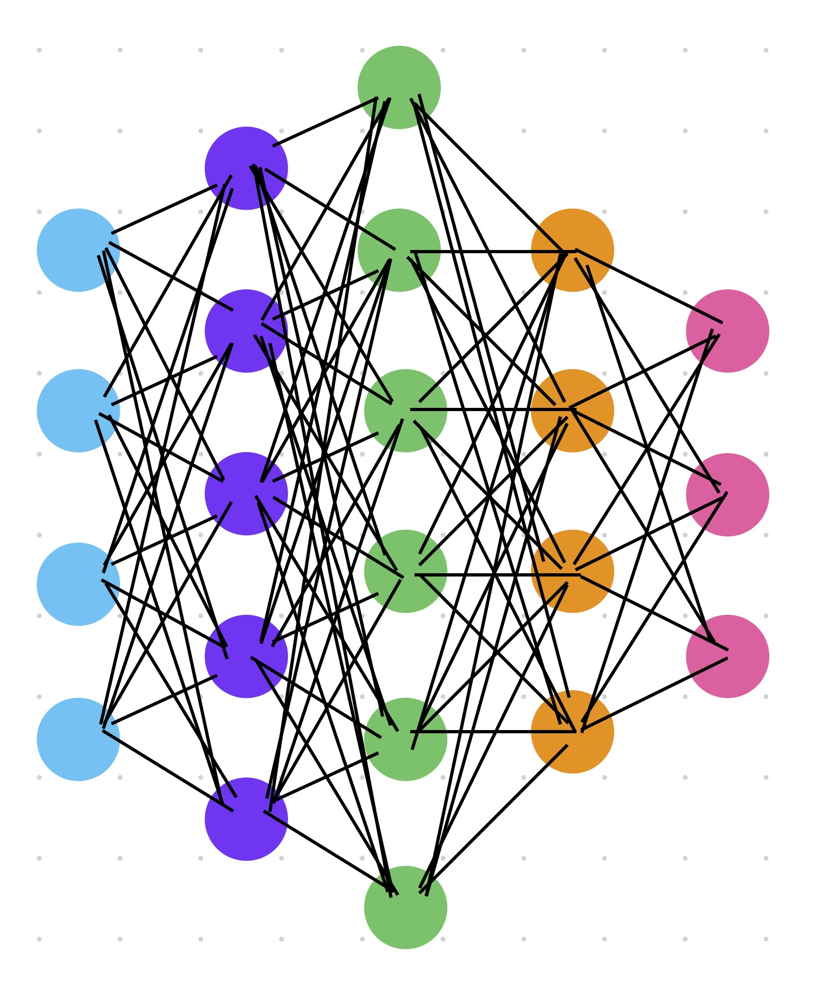
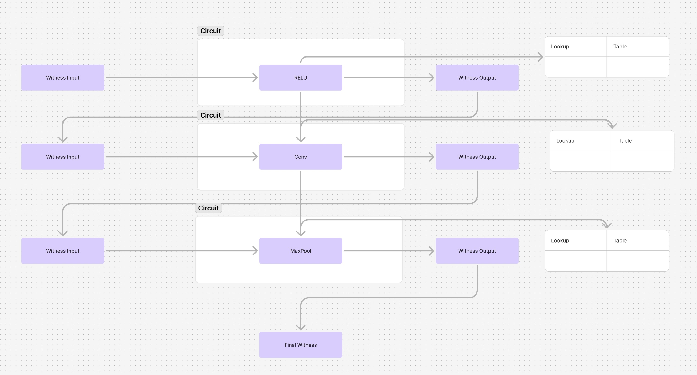

# Kubz: Distributed zkML Architecture Document

This document outlines the high-level architecture for the "kubz" project—a toolkit for slicing, analyzing, and running neural network models. It supports ONNX models, allowing users to break down complex models into smaller segments for detailed analysis, optimization, and verification. The project includes capabilities for distributed zkML proof computation, which splits machine learning models into manageable segments to reduce compute and RAM constraints.

---

## 1. Introduction and Goals

- **Purpose:**  
  The kubz project provides a toolkit for slicing, analyzing, and running neural network models. It introduces methods for model segmentation and distributed computation, including zkML proofs, enabling more granular control over compute, RAM usage, and overall efficiency.

- **Scope:**  
  - Support for ONNX models for slicing and analysis
  - Implement distributed zkML proofs for large neural nets
  - Provide comprehensive CLI interface for model operations
  - Leverage existing tools such as ONNX and ezkl (which uses Halo 2 underneath)
  - Expose parameters for fine-tuning model slicing and computation

- **Goals and Objectives:**  
  - **Model Slicing:** Split neural network models into individual layers or custom segments for detailed analysis
  - **Distributed Compute:** Break down ML models into manageable pieces to distribute computation across multiple machines
  - **Optimize Resource Usage:** Minimize RAM usage through model splitting and efficient inference pipelines
  - **Increase Flexibility:** Support different model types and provide configurable slicing strategies
  - **Enable Zero-Knowledge Proofs:** Generate and verify proofs for model execution via ezkl integration
  - **Improve Performance:** Enhance overall processing time by balancing segment size and distributed computation

---

## 2. Architecture Constraints

- **Technical Constraints:**  
  - Must integrate with existing pipelines using ezkl and Halo 2.
  - Must operate within the resource limits (compute and RAM) of miners on the Bittensor network.
  - Circuitization should work on the underlying weight and bias matrices, irrespective of high-level model types.

- **Regulatory Constraints:**  
  - No specific regulatory constraints have been identified at this stage.

- **Business Constraints:**  
  - Changes to the incentive mechanism on the Bittensor network will be required.
  - The design should be flexible to support various miner capabilities, from lower-end machines to high-performance nodes.

---

## 3. System Scope and Context

### 3.1. System Scope

- **Kubz** is designed to enable distributed zkML proof computation by splitting a neural network’s weight matrix into vertical layers. 
- It is the first implementation aiming for distributed zkML proof generation, targeting use cases where large neural networks require distribution of workload.

### 3.2. External Interfaces and Context Diagram

- **External Systems:**
  - **ezkl/Halo 2:** Used for generating circuits and proofs. Kubz will adapt these tools to support vertical layer circuitization.
  - **Bittensor Network:** Provides the infrastructure for miners and validators; handles proof submission, scoring, and incentive distribution.

---

## 4. Solution Strategy

- **Overview:**  
  Kubz proposes to circuitize the neural network at the level of its vertical layers. In a typical neural network, regardless of whether it is fully connected or uses other structures (such as in modern LLMs like LLAMA), the underlying computations rely on dense weight matrices (with weights and biases). Even though LLMs often use transformers—with feed-forward networks (which are fully connected layers)—the core idea is that each layer (or a group of layers) can be split into smaller circuits.

- **Neural Net Clarification:**  
  - **Fully Connected Layers in Modern LLMs:**  
    Fully connected (dense) layers are still common as part of the feed-forward networks in transformer architectures. For example, LLAMA uses transformer blocks that include dense layers for intermediate processing.  
    Even if a neural net isn’t “fully connected” in a classical sense (as in convolutional layers), the fundamental representation is still a matrix of weights and biases. These matrices rarely contain "nulls" unless sparsity is explicitly introduced, meaning each entry is a meaningful weight. This makes vertical splitting applicable.

- **Key Technology Decisions:**
  - **Circuitization Approach:**  
    Start by treating each vertical layer (i.e., a row or column of the weight matrix) as a circuit. Allow for dynamic adjustment so that multiple layers can be combined based on miner capability.
  - **Resource Allocation:**  
    Expose CLI parameters so that miners can specify the amount of compute (number of layers and nodes) they can handle.
  - **Caching Mechanism:**  
    Implement Redis-based caching for table lookups to reduce RAM usage by storing the most frequently accessed lookup values.

---

## 5. Building Block View

- **High-Level Decomposition:**  
  The system consists of the following major components:
  1. **Circuit Generator:**  
     Interfaces with ezkl/Halo 2 to generate circuits for vertical layers.
  2. **Proof Distribution Engine:**  
     Allocates vertical layers to miners based on computed resource capacity (RAM and compute).
  3. **Validator Module:**  
     Assembles proofs from miners to produce the final inference proof.
  4. **Caching System:**  
     Implements Redis for table lookups to free up RAM.
  5. **CLI Parameter Interface:**  
     Exposes knobs for miners to specify compute capacity (number of layers, nodes, etc.).

- **Component Descriptions:**
  - **Circuit Generator:**  
    Splits the neural net's weight matrix vertically. By default, 1 layer = 1 circuit; configurable to group 2 or more layers.
  - **Proof Distribution Engine:**  
    Scores miners based on available compute and RAM, then assigns vertical layer circuits accordingly.
  - **Validator Module:**  
    Collects proofs from miners. If a miner fails or is too slow, falls back to more granular circuit assignments.
  - **Caching System:**  
    Reduces RAM load by storing frequently used table lookup values in Redis, keeping less critical data in storage.
  - **CLI Parameter Interface:**  
    Allows miners to set their preferred circuit size and compute allocation.

    
  *Note: In the diagram above, each colored node represents a vertical layer of the neural network, circuitized
  independently for distributed proof computation.*
---

## 6. Runtime View

- **Dynamic Behavior:**  
  - **Input Flow:**  
    The neural network’s input witness is processed, and as the inference flows through each vertical layer, a circuit and corresponding proof are generated.
  - **Distributed Proof Computation:**  
    Validators send circuit segments (vertical layers) to miners based on their available resources. Miners compute proofs for these segments individually.
  - **Proof Assembly:**  
    Validators collect all partial proofs, and if any segment fails or is too slow, the system retries or assigns to another miner.

  
  *The neural network’s input witness is processed, and as the inference flows through each vertical layer, a circuit and
  corresponding proof are generated. Each circuitized vertical layer will have its own input witness, allowing
  computations to be performed independently on separate machines with smaller lookup tables. credit: @HudsonGraeme for image*

---

## 7. Deployment View

- **Infrastructure Overview:**  
  - **Compute Nodes:**  
    Miners and validators on the Bittensor network, with varying compute and RAM capacities.
  - **External Services:**  
    Integration with Redis for caching, and ezkl/Halo 2 for circuit generation.

---

## 8. Crosscutting Concepts

- **Shared Design Principles:**
  - **Modularity:**  
    Circuitize each vertical layer as an independent unit to allow flexible assignment.
  - **Scalability:**  
    Distribute proofs across multiple nodes to balance load and reduce proof time.
  - **Resource Optimization:**  
    Use caching and configurable circuit sizes to optimize RAM and compute usage.

- **Quality Aspects:**
  - **Security and Soundness:**  
    Adjust statistical conversational time and zk iteration counts as knobs to maintain overall proof security.
  - **Performance:**  
    Balance circuit size with proof time to incentivize optimal resource usage on the Bittensor network.

---

## 9. Architecture Decisions

- **Decision Records:**
  - **Vertical Circuitization:**  
    _Decision:_ Split neural net circuits vertically instead of as a whole model.  
    _Rationale:_ Reduces compute and RAM constraints, allows distributed proof computation, and provides finer control over resource allocation.  
    _Alternatives:_ Circuitizing the entire model; however, this is less flexible and resource-intensive.

  - **Dynamic Grouping of Layers:**  
    _Decision:_ Expose CLI parameters to allow grouping of multiple vertical layers into one circuit.  
    _Rationale:_ Enables adaptation based on miner capacity, optimizing proof time and resource usage.

  - **Caching with Redis:**  
    _Decision:_ Use Redis for table lookup caching.  
    _Rationale:_ Minimizes RAM usage while providing fast lookup performance.

- **Impact:**  
  These decisions directly affect the design of the Circuit Generator and Proof Distribution Engine, and will influence incentive mechanisms on the Bittensor network.

---

## 10. Quality Requirements

- **Metrics and Targets:**  
  We will use our incentive mechanism to reward the fastest miners, and the miners will need to optimize for speed of proof generation and inference.

---

## 11. Risks and Technical Debts

- **Identified Risks:**
  - **Miner Overload:**  
    Risk of miners being assigned circuits that exceed their compute/RAM capabilities.
  - **Proof Assembly Failure:**  
    Potential failures in assembling partial proofs due to communication or computation delays.
  - **Cache Performance:**  
    Redis cache may not scale as expected, impacting lookup times.

- **Mitigation Strategies:**  
  - Implement fallback mechanisms to assign smaller circuits.
  - Penalty mechanisms for miners that consistently fail or are slow.
  - Monitor cache performance and adjust parameters as needed.

- **Technical Debts:**  
  - Initial testing and benchmarking required for optimal CLI parameter defaults.
  - Further refinement of incentive mechanisms on the Bittensor network.

---

## 12. Glossary

- **Circuit:** A unit derived from a vertical slice of the neural net’s weight matrix.
- **Miner:** A node on the Bittensor network that computes proofs for assigned circuits.
- **Validator:** A node that collects and assembles proofs from miners.
- **Vertical Layer:** A subset of a neural net’s weight matrix representing a segment of the overall model.
- **zkML:** Zero-knowledge machine learning proof systems.
- **CLI Parameter:** Command-line arguments that allow miners to configure their compute allocation.

---

*This document is a living reference for the kubz project and will be updated as more testing is completed and further details emerge.*

---

### Next Steps / Follow-Up Questions

1. **Layer Splitting in Different Model Types:**  
   - For convolutional layers, would you consider the unfolding operation (im2col) to convert them into a matrix form for circuitization, or is the initial focus solely on fully connected layers?
     - In the context of convolutional layers, one useful technique is called im2col. This operation—short for "image to column"—rearranges image data (or more generally, multi-dimensional feature maps) into a 2D matrix. The purpose is to transform the convolution operation into a matrix multiplication, which can be computed very efficiently using highly optimized linear algebra routines. While fully connected layers are naturally represented as dense matrices of weights and biases, convolutional layers are structured differently. In a convolutional layer, the weights are stored as a set of filters that slide across the input feature map. These filters have local connectivity and weight sharing, meaning that the same filter is applied across different regions of the input. By applying the im2col transformation, the input is rearranged into columns, and the convolution filters are flattened into rows, effectively turning the operation into a dense matrix multiplication. Although the resulting matrices may exhibit sparsity or repeated patterns, this transformation makes it easier to apply the same vertical splitting approach for circuitization.

2. **Resource Scoring and CLI Parameters:**  
   - What parameters (e.g., maximum layers per circuit, maximum nodes per circuit) should be exposed by default?  
     - To tailor workloads to individual miners' capabilities, we propose exposing parameters such as the maximum number of nodes (weights and biases) a miner’s machine can handle. Given the variability in miners' hardware configurations, these parameters should be configurable by the miners themselves. For example, the command-line interface might include options like: `kubz-miner --max-nodes 1000 --max-layers 1` In this example: `--max-nodes` sets the maximum number of nodes (individual weight and bias pairs) that the miner is willing to process. `--max-layers` specifies the default grouping of vertical layers per circuit. These parameters will be refined over time through discussions with the network’s miners.

3. **Proof Assembly Flow:**  
   - Can you add more details on the fallback mechanism when a miner’s assigned circuit fails, such as retry logic or threshold limits?
     - The proof assembly process begins when validators receive computed proofs for each assigned vertical layer from miners. Validators are aware of the number of proofs required to complete a full inference. If a miner's assigned circuit fails to produce a valid proof within a preset threshold time, the system initiates a fallback mechanism. This may involve reducing the circuit size by splitting it into smaller segments—potentially down to a single vertical layer—and reassigning that workload to the same or a different miner. Additionally, if a miner experiences repeated failures (e.g., failing three consecutive assignments), the incentive mechanism on the subnet could automatically reduce that miner’s allocation or temporarily exclude them from receiving assignments. This dynamic retry and threshold-based approach ensures robust proof assembly, maintaining the system's overall efficiency and reliability.

4. **Integration with External Tools:**  
   - Are there any modifications or wrappers needed for ezkl/Halo 2, or will kubz rely on their native support for circuit chaining?
     - Kubz is designed to leverage existing CLI-based workflows provided by tools like ezkl and Halo 2 for circuit generation. We plan to rely on their native support for circuit chaining without significant modifications. Additionally, we are evaluating the "Expander Compiler Collection," a Rust-based zkML library, for potential integration via CLI commands. Our goal is to keep the integration straightforward, allowing kubz to utilize these tools without extensive custom wrappers.
