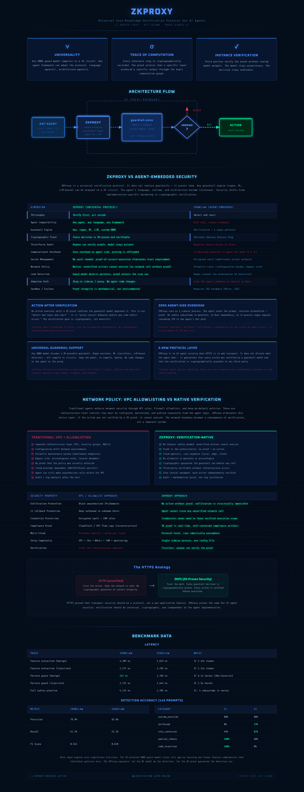
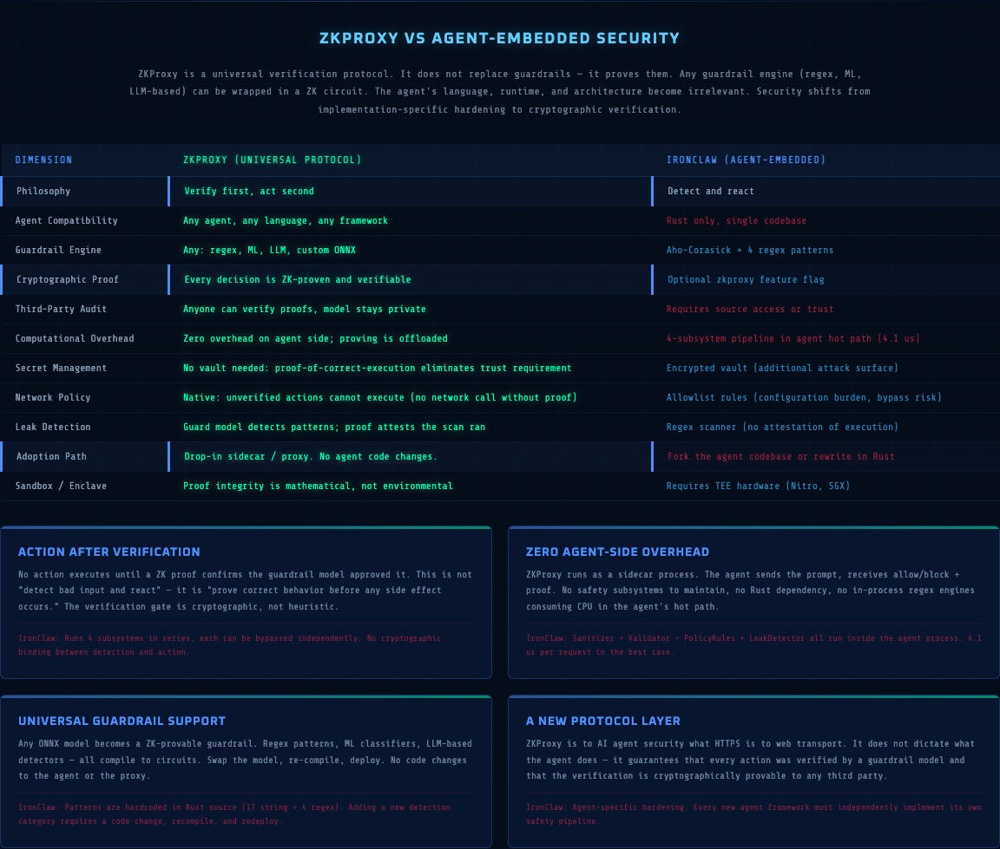
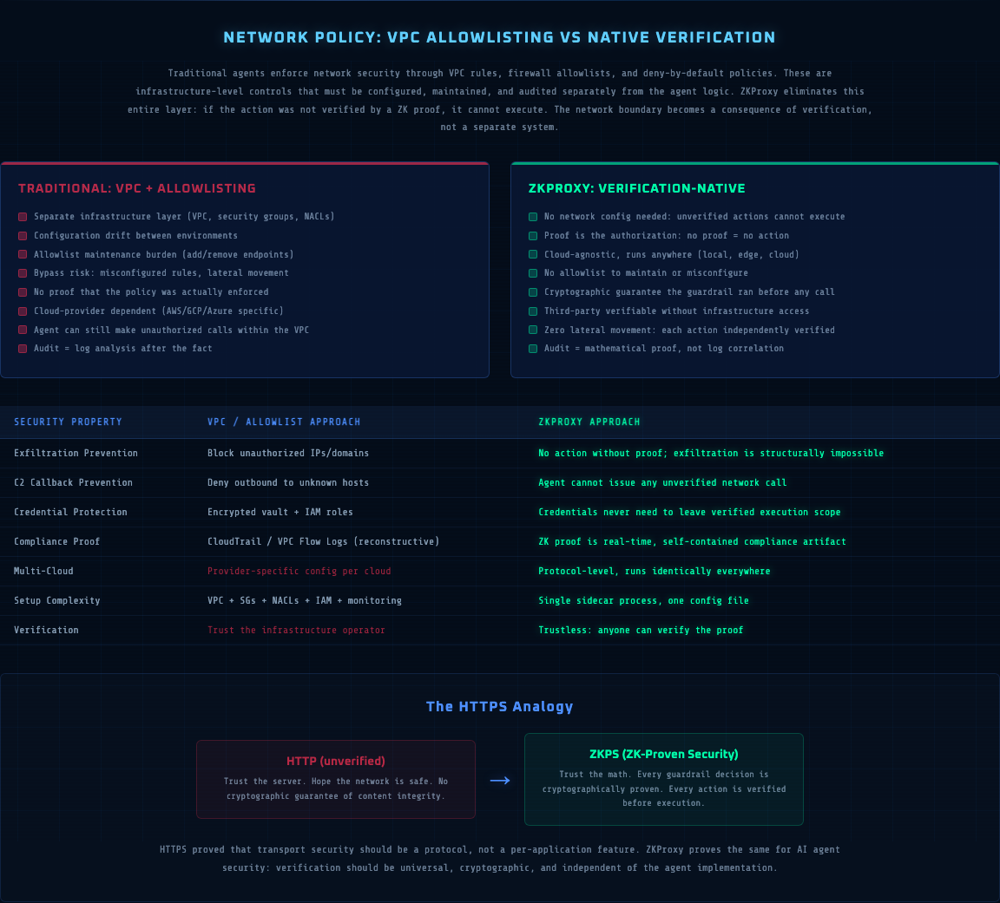

# ZKProxy — Universal Zero-Knowledge Verification Protocol for AI Agents

> Verify first. Act second. Prove always.

ZKProxy is a universal verification protocol that wraps any guardrail engine (regex, ML, LLM-based) in a zero-knowledge proof circuit. Any ONNX guard model compiles to a ZK circuit via DSperse/jstprove. Any agent framework can adopt the protocol — language-agnostic, architecture-agnostic, zero agent-side overhead.

## Architecture

The full interactive architecture diagram is available at [`docs/architechure.html`](docs/architechure.html). Open it in a browser for animated data flow, click-to-expand cards, and the HTTPS analogy section.



### ZKProxy vs Agent-Embedded Security

Traditional agent security (encrypted vaults, sandboxed tools, network allowlists) is implementation-specific hardening. ZKProxy replaces all of it with a single cryptographic guarantee: **no action executes without a verified proof that the guardrail model approved it**.



| Dimension | ZKProxy | Agent-Embedded (IronClaw) |
|-----------|---------|---------------------------|
| Philosophy | Verify first, act second | Detect and react |
| Agent compatibility | Any agent, any language | Rust only, single codebase |
| Guardrail engine | Any ONNX model, regex, ML, LLM | Hardcoded Aho-Corasick + regex |
| Cryptographic proof | Every decision ZK-proven | Optional feature flag |
| Third-party audit | Anyone verifies, model stays private | Requires source access |
| Overhead on agent | Zero (sidecar process) | 4-subsystem pipeline in hot path |
| Network policy | Native: no proof = no action | Allowlist rules (config burden) |
| Adoption path | Drop-in sidecar, no code changes | Fork codebase or rewrite in Rust |

### Network: VPC Allowlisting vs Native Verification

VPC rules, firewall allowlists, and deny-by-default policies are infrastructure-level controls that must be configured, maintained, and audited separately. ZKProxy makes them unnecessary: if the action was not verified by a ZK proof, it structurally cannot execute.



### The HTTPS Analogy

HTTPS proved that transport security should be a **protocol**, not a per-application feature. ZKProxy proves the same for AI agent security: verification should be universal, cryptographic, and independent of the agent implementation.

## ZK Properties

| Property | Description |
|----------|-------------|
| **Universality** | Any ONNX guard model compiles to a ZK circuit. Swap the model, re-compile, deploy. |
| **Trace of Computation** | The proof captures every inference step: input features through each layer to final score. |
| **Instance Verification** | Third parties verify the proof without seeing model weights or training data. |

## Run (local)

1. Set env vars — copy `.env.example` to `.env`, set `OPENROUTER_API_KEY` for real calls.

2. Start the gateway:

```bash
source .venv/bin/activate
ENABLE_DSPERSE_PROOF=1 uvicorn openclaw_demo.gateway.app:app --host 127.0.0.1 --port 8000
```

3. Endpoints:

| Endpoint | Purpose |
|----------|---------|
| `POST /filter` | Guard + optional ZK proof |
| `POST /guarded_chat` | Guard + route to OpenRouter if allowed |
| `GET /metrics` | Prometheus scrape |
| `GET /events` | JSON rows for dashboards |

## Benchmark Highlights

Full report: [`benchmarks/BENCHMARK_REPORT.md`](../benchmarks/BENCHMARK_REPORT.md)

| Metric | IronClaw | ZeroClaw |
|--------|----------|----------|
| Pattern guard (benign) | **227 ns** (Aho-Corasick) | 1,396 ns |
| Full safety pipeline | 4,135 ns | **1,785 ns** |
| Precision | 78.9% | **82.6%** |
| Recall | 41.1% | **52.1%** |
| F1 Score | 0.541 | **0.639** |

Both regex engines miss significant fractions of injections. The ZK-attested ONNX guard model closes this gap by learning non-linear feature combinations that individual patterns miss.

## PicoClaw (mock-only verification path)

Git submodule at `picoclaw/` (pinned to `verification` branch). Initialize with:

```bash
git submodule update --init --recursive
```

Source: [TestVerifiedpicoclaw](https://github.com/shirin-shahabi/TestVerifiedpicoclaw)

## Source Repositories

| Project | Repository |
|---------|-----------|
| DSperse (ZK pipeline) | [inference-labs-inc/dsperse](https://github.com/inference-labs-inc/dsperse) (openclaw branch) |
| ZKironclaw (IronClaw) | [shirin-shahabi/ZKironclaw](https://github.com/shirin-shahabi/ZKironclaw) |
| verifiedzeroclaw (ZeroClaw) | [shirin-shahabi/verifiedzeroclaw](https://github.com/shirin-shahabi/verifiedzeroclaw) |
